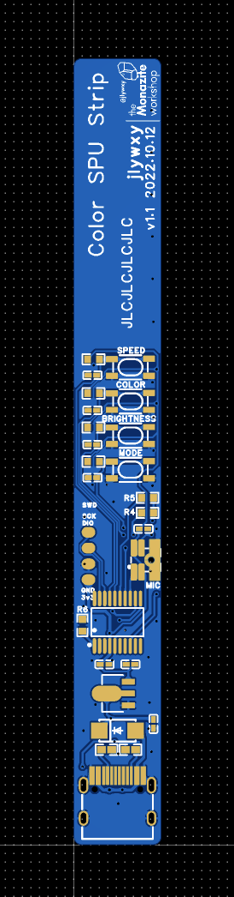
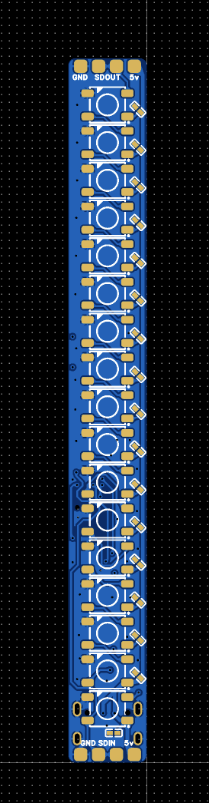
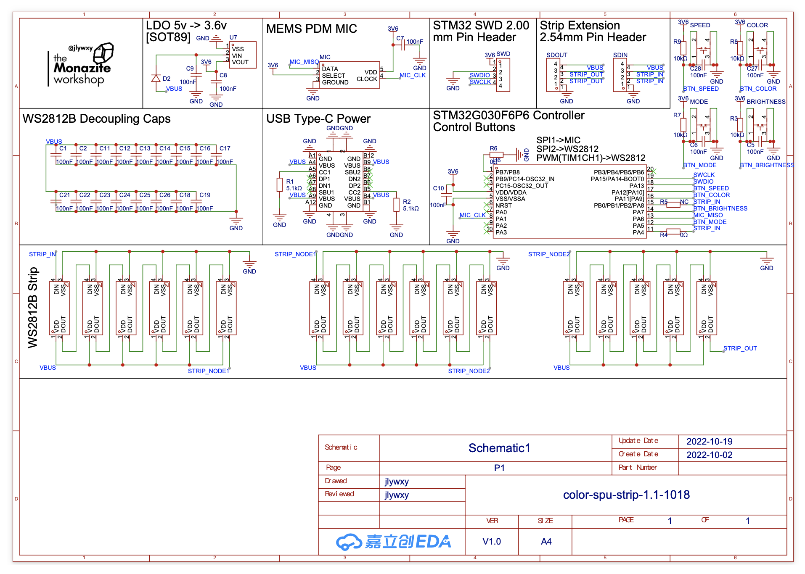

# Color Sound-Pickup Strip

A Low-Cost Sound Pickup Colorful Light Strip, using PDM Microphone, STM32 and WS2812.<br>
The over-all cost of the board is less than 1 dollar.<br>
Note: this design is not the final design.<br>

<br>
Author: jlywxy (jlywxy@outlook.com)<br>
Document Version: 1.0

- --
## Availability


When moving the audio source near to the strip, the light region should expand; When talking a little bit loud, the strip also responds.

- --
## Hardware Design

1.The MCU is STM32G030F6P6(Cortex M0+, max clock 64MHz, 32K Flash, 8K RAM, 2 SPIs)<br>
The light bulbs are WS2812B from worldsemi(packaging 5050)<br>
The Microphone is SPH0641LM4H from Knowles(0.5 cycle PDM output)<br>
The Power supply connector is 16pin USB Type-C, with CC signal line connected 5.1k Ohm Pull-Down resistors.
The LDO providing VDD to STM32 is 3.6v 6206A.The STM32 VDDIO could meet with WS2812B in 5v VDD.

2.PCB Layout Suggestions<br>

* Do not place WS2812B signal line near to board edge, which will cause EMI when hand touches the edge, causing the first WS2812B blinking in green.

3.PCB Image, Schematic and Gerber<br>




For Schematic PDF and Gerber File, look into directory <a href="hardware">hardware</a>


- --
## Software Design
1. Processing of PDM signal<br>
In order to process PDM audio signal, it is normal to use DSP or "DFSDM" peripheral to convert PDM to PCM, which involves filter(FIR) or other math process. However, when the non-precise audio loudness data is the only required data, the process of converting can be simplified.<br>
When talking to the principle of PDM, the wiki or thesis says PDM is "Pulse Density Modulation", which means the data is represented in "1" and "0" in stream, and the density of "1" represents the real audio loudiness, therefore counting number of "1" in certain amout of samples is able to get audio loudness.<br>
However, when coming into practise, the amount of samples for summing of "1" is hard to decide. Too more sample results in the calculated audio loudiness only sensitive to low frequencies, while too little causes it not sensitive to all sounds. The process in this project is trying to cover different band of audio frequencies by canculating more than 1 time and changing the amount of samlpes(sum size).
```
sum process
1. (0~12),(2~14),(4~16),...  //step is 2, sum size is 12
2. (0~24),(1~25),(2~26),...  //step is 1, sum size is 24
...

number in () represents data index of PDM buffer.
```
Note: In order to decrease processing pressure, the sum step may be larger than 1. The sum size is based on experiment, which have not been simulated and test precisely by professional methods.<br>
The sum process calculated and trim data within wanted region for every "sum size", picking up the max value, then send to light strip buffer.

2. WS2812 Driver<br>
This project use 800KHz PWM with DMA to modify duty cycle.<br>
Inspired by https://controllerstech.com/interface-ws2812-with-stm32/

3. MEMS PDM Microphone Driver<br>
It's simple to use SPI to receive PDM signal from MEMS Microphone. STM32 works as "Receive Only Master", which means STM32 generates clock and receive data from MOSI.

3. DMA and Interrupt Design
WS2812 PWM signal buffer of DMA is controlling PWM duty cycle. When transfer ended, the new transfer is controlled manually.<br>
MEMS Microphone SPI signal buffer of DMA is receiving data from Microphone. The transfer is circular.

4. Color Smooth Transition
This project uses a simplified RGB to HSL converting method. Firstly, the full color set is diveded in to 6 region(red,magneta,blue,cyan,green,yellow: RMBCGY), then the input hue data is required to decide the wanted color region, finally the color is decided in the certain region.

- --
## Further improvement
Note: part of the following improvements have been done in the following design.
1. Add another MIC to make a MIC array to improve sensitivity.
2. Use 0.8mm PCB thickness when manufacturing PCB, and enlarge MIC audio port hole to allow more sound going through the PCM to the MIC.