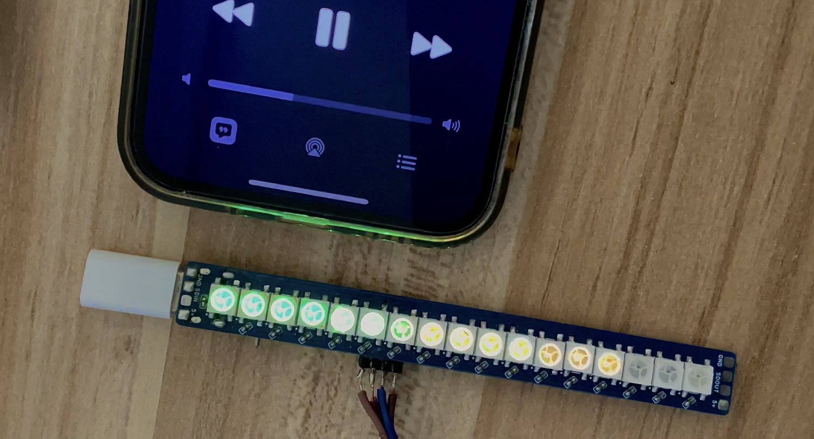
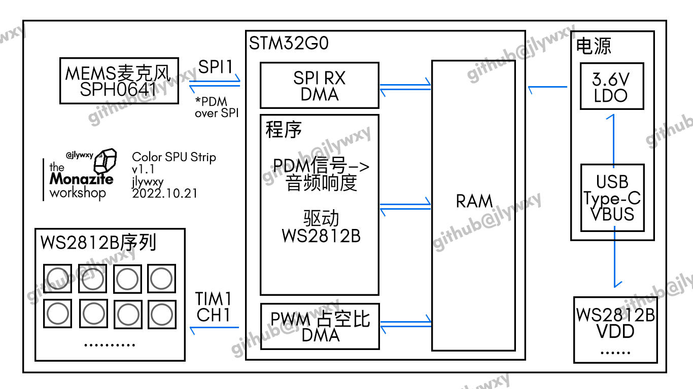
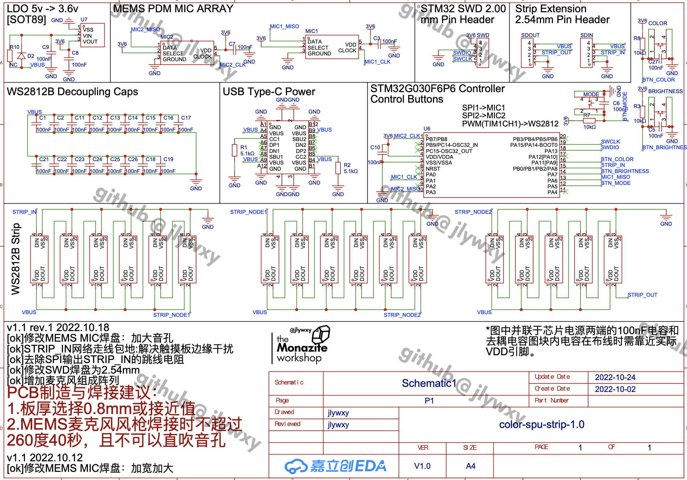
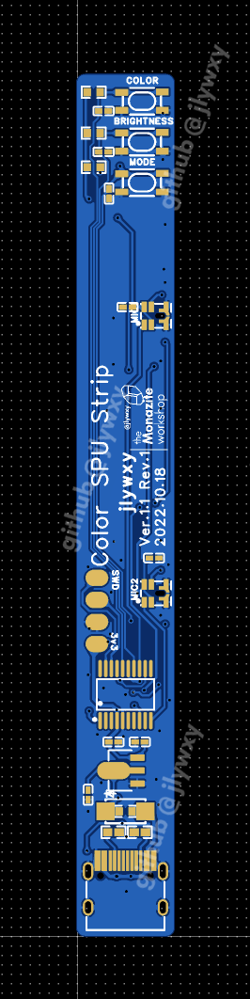
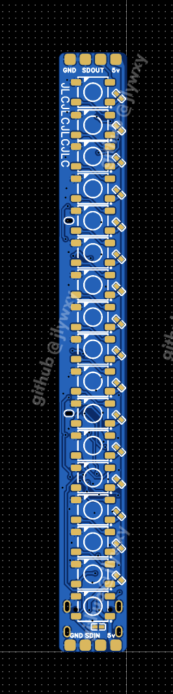

# Color SPU Strip
低成本较高灵敏度炫彩拾音灯条设计，采用MEMS硅麦、STM32G0和WS2812B等实现。<br>
总成本不高于10元(当前设计版本的成本约为7.1元 人民币)<br>

<b>本次开放的设计为开源版本的最终设计。</b>

<br>
作者: jlywxy(jlywxy@outlook.com)<br>
文档版本: 1.1-chn (2022.10.24)<br>

- --

当前设计版本：硬件 v1.1 rev1，软件 v1.1，系统版本 v1.2<br>

当前开源状态：<br>
```
[ok]原理图
[ok]Gerber
[ok]主要算法
[ok]编译的固件
[  ]软件(CMake)工程文件
[  ]EDA(嘉立创)设计工程文件
```

- --

## 主要功能
1. 通过硅麦采集环境音，并通过亮起的灯条长度指示声音响度，且通过颜色渐变指示声音频率范围。
2. 具有按钮切换灯条功能和状态
3. 通过USB Type-C 供电

- --

## 实现效果

<br>
当将音源移动至灯条附近时，灯条亮起的长度会变化。当在灯条附近说话谈论声音较大时，灯条也会有响应。<br>
视频演示1：https://www.bilibili.com/video/BV1Pd4y127or<br>
视频演示2：审核中
- --

## 系统功能框架


- --

## 硬件设计

1. BOM表<br>
```
型号                       数量     品牌
----------------------------------------------
STM32G030F6P6              1个     ST
SPH0641LM4H                1个     Knowles
XC6206A(3.6v)              1个     -
USB Type-C 连接器(16p)      1个     -
WS2812B                    17个    worldsemi或兼容
100nF 0402贴片电容           22个    -
5.1k Ohm 0402/0603贴片电阻   2个     -
0 Ohm 0603贴片电阻          1个      -
通用二极管 SMA贴片（非必需）   1个      -
3*4*2.5 贴片四脚按钮         1个      -
```

2. 部分选型依据<br>
MEMS麦克风（也称硅麦）价格便宜，集成度高，本项目采用PDM信号输出的MEMS麦克风（Knowles SPH0641LM4H）。不采用I2S输出的麦克风是因为其价格过高。<br>
硅麦相比于咪头（也称驻极体麦克风）的优势在于硅麦灵敏度较高：灵敏度达-26dBFS(数值越大(绝对值越小)越灵敏)，咪头（以松下WM-61x为例）仅为-35dB（注意：db与dbFS并非描述同一物理量的单位，但可依此粗略的表示差距）。移动设备（手机、电脑、蓝牙耳机）大量采用硅麦而不是咪头进行声音采集。

3. PCB布局和制造建议<br>
* WS2812B信号线避免走在板子边缘，否则手指触碰板边缘会造成干扰。

4. 原理图、Gerber和其他事项<br>
* 原理图：<br>
注意：<b>本原理图中部分元件为冗余元件。</b>MIC2焊盘需留空。<br>
* Gerber: <a href="hardware/gerber-1.1r1.zip">hardware/gerber-1.1r1.zip</a><br>



- --

## 软件设计

1. 本项目采用的拾音元件输出信号为PDM(脉冲密度调制)，但STM32仅在Cortex-M33及以上的部分mcu中提供解码此信号的外设(DSP, DFSDM)。<br>
因此本项目完全采用软件实现PDM信号转换为声音响度数据，此算法的特点是可以获取特定频段的响度（粗略测定）。<br>
* 注意：解码PDM信号的常用做法为使用低通滤波器。本项目考虑mcu算力而未采用滤波器等算法。<br>
PDM调制的基本概念：https://en.wikipedia.org/wiki/Pulse-density_modulation<br>
算法主要部分如下：（动画演示详见上文“视频演示2”）<br>
```c
#define MAX_LED 17          //灯条上WS2812B的数量（或期望的响度范围）
#define PDM_SAMPLES 512     //PDM Buffer的大小
/*
 * 方法：PDM 转换为 音频响度
 * 参数：
        buf - PDM数据Buffer
        start - 转换起点（范围：0～PDM_SAMPLES-1）
        end - 转换终点（范围：0～PDM_SAMPLES-1）
 * 返回值：音频响度（范围：0～(end-start)*8/2）
 */
int pdm2amp(const uint8_t *buf, int start, int end) {
    int maxAmp = 0;
    int amp = 0;
    for (int i = start; i < end; i++) {
        for (int j = 0; j < 8; j++) {
            if (((buf[i] >> j) & 1) == 1) {
                amp++;
            }
        }
    }
    int ledDestination = (amp - (end - start) * 8 / 2);
    if (ledDestination < 0)ledDestination = -ledDestination;
    if (ledDestination > MAX_LED)ledDestination = MAX_LED;

    if (ledDestination > maxAmp) {
        maxAmp = ledDestination;
    }
    return maxAmp;
}
```
* 目前仅公开此部分转换算法和已编译好的固件（<a href="hardware/color-spu-strip-1.1.bin">hardware/color-spu-strip-1.1.bin</a>），不公开其他算法（颜色渐变等）和系统完整的软件工程文件。
* 注意：本算法的实现效果和mcu主频有一定相关性；转换过程并非完全精确（部分参数采用实验值），没有经过专业仪器和方法测定。算法需要进一步的改进。<br>

2. WS2812B的驱动方式是采用800KHz可变占空比的PWM。
参考于 https://controllerstech.com/interface-ws2812-with-stm32/

- --
## 杂项
* 为削弱本开源资料的产品性，开放的固件和设计相对于正在开发的版本已经删掉了部分功能，后续版本不再开源。